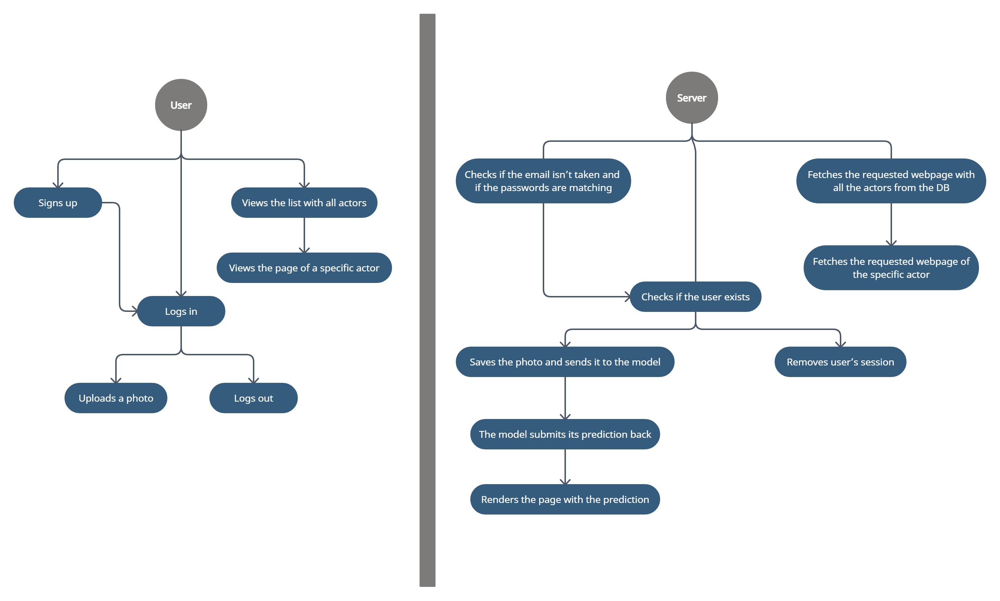

# Find my Actors

Find my Actors is a web application created for users to use it similarly to Shazam, but our app is specialized on detecting actors faces from pictures.

## Team members

- Gheorghe Robert-Mihai
- Militaru Mihai-Alexandru
- Dilirici Mihai
- Dumitru Paul-Valentin

## 1. User Stories

01. As a user, I want to be able to create an account.
02. As a user, I want view all the actors from the app.
03. As a user, I want to upload a photo or a video with an actor.
04. As a user, I want to view details about any actor.
05. As an admin, I want to be able to add another actor to the website.
06. As an admin, I want to edit or remove any actor from the database.
07. As a user, I want to see the most searched actors in the website.
08. As a user, I want to be able to search a specific actor by name.
09. As a user, I want to see what actors the website recognized from my previous uploads.
10. As a user, I want to see some of the results from other users uploads.

## 2. Diagrams

Here is the Behavior Diagram for our app.

## 3. Git source control

The application used only this GitHub repository for source control. All branches, commits and pull requests can be seen there.

## 4. Bug reporting and fixing with pull requests

Bugs have been reported and fixed using pull requests. You can see them in the [Pull requests](https://github.com/surtexx/Find-my-Actors/pulls?q=is%3Apr+is%3Aclosed) section of our project.

## 5. Refactoring and code standards

- Refactored code can be found here:
  	1. We added comments and removed unnecessary code: [here](3716a4156b5c25c4f98cc4d752e8583f85f731f9).
  	2. Simplified code: [here](e396b2b2c31759c86ffd9ce481c8c016b0b7c554).
- Code follows PEP8 code style guide for Python(https://peps.python.org/pep-0008/).

## 6. Code comments

Comments can be seen in various source code files in our repository, such as [FMA.py](https://github.com/surtexx/Find-my-Actors/blob/main/FMA.py) or [auth.py](https://github.com/surtexx/Find-my-Actors/blob/main/website/auth.py) to ensure more information is given regarding the code.

## 7. Design Patterns

We used the Modular Design pattern to ensure loading the main page for the type of user that requested it (logged in or guest). This was achieved by using the Blueprint class from Flask.

## 8. Using AI tools to develop the app

We used GitHub Copilot to do simple tasks like iterating through an array of objects, to increase the speed of development and automate trivial tasks. ChatGPT also came handy in figuring out the correct order of some parameters in functions and in other situations that can pe seen [here](https://chat.openai.com/share/f7d0f025-d8bb-4056-b806-77891a07db0e)
